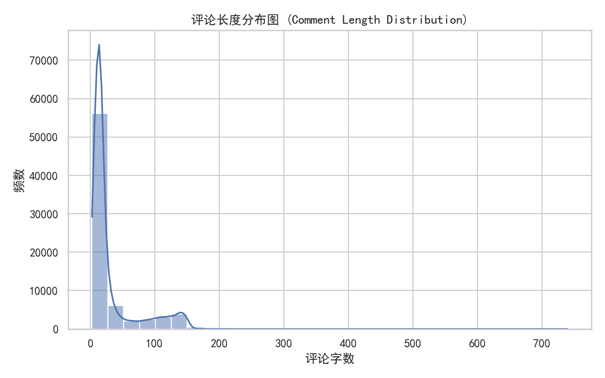
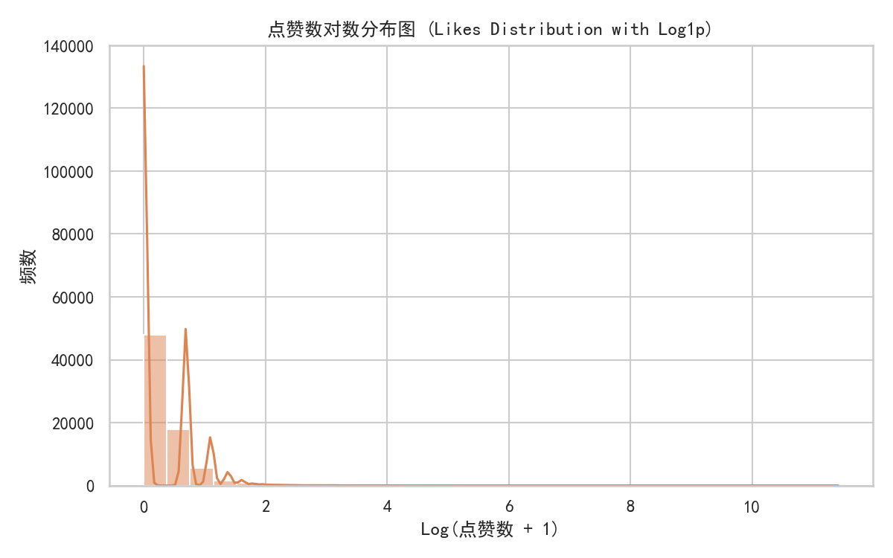
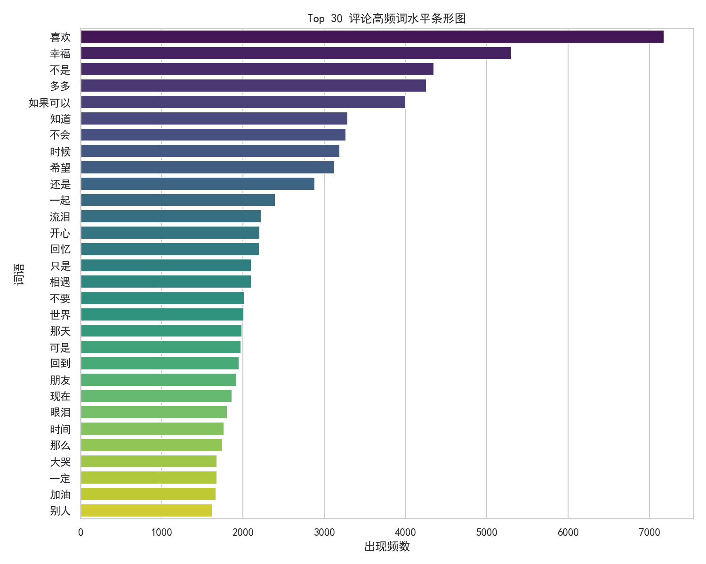
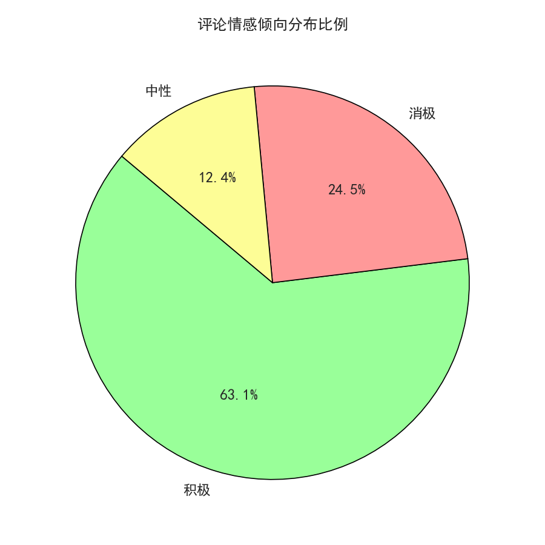
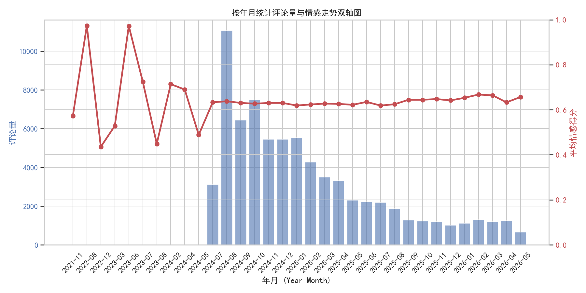
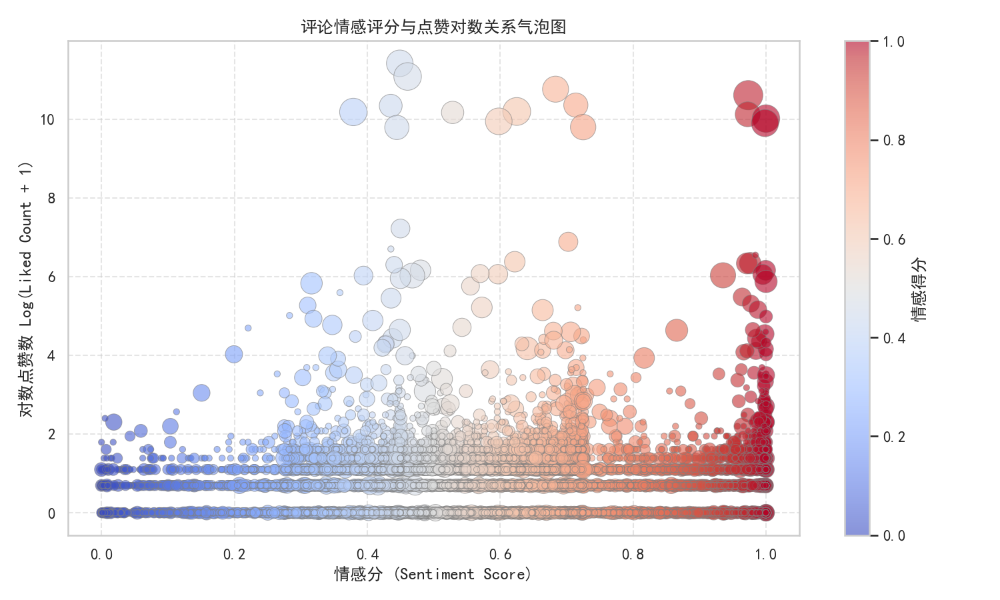
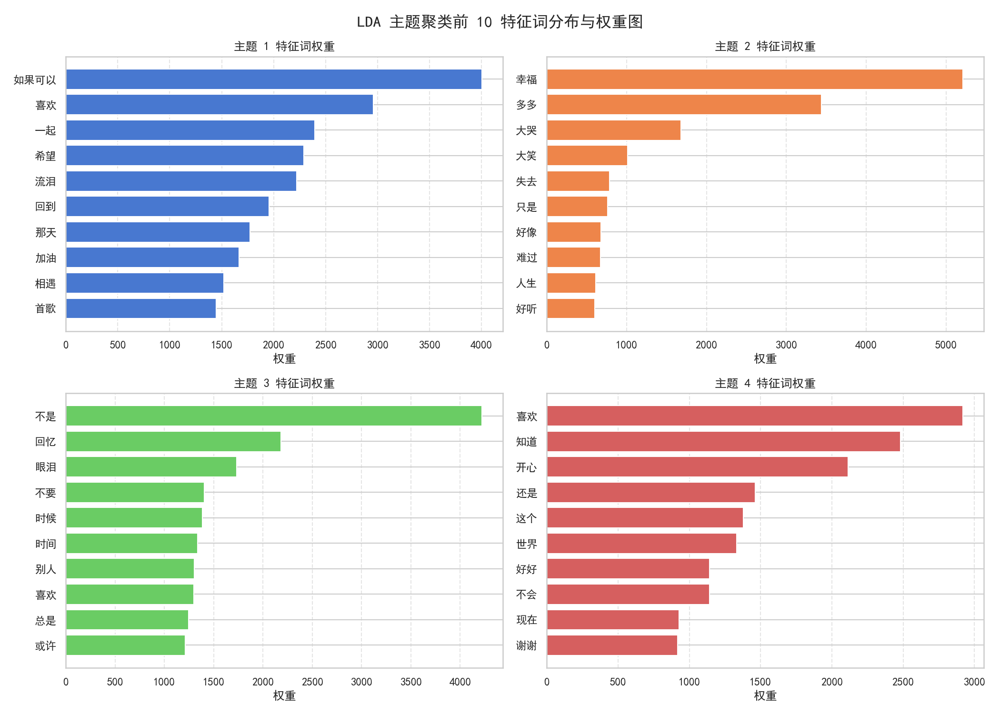

# 数据可视化作业2：网易云音乐评论区文本可视化
## 提交报告

---

## 基本信息

| 项目 | 内容 |
|------|------|
| 所选歌曲 | 《如果可以》—— 韦礼安 |
| 数据量（预处理前） | 100,015 条 |
| 数据量（预处理后） | 74,384 条 |
| 使用的AI工具 | Claude Code（辅助代码生成、数据清洗脚本编写、情感分析优化、可视化页面构建） |

---

## 一、数据获取与预处理（15分）

### 1.1 数据来源说明

数据来源于网易云音乐《如果可以》（韦礼安）歌曲评论区，通过API接口爬取获得。原始数据包含 `Comment_ID`、`User_ID`、`Nickname`、`Content`、`Liked_Count`、`Reply_Count`、`Time_String`、`Timestamp`、`IP_Location` 等字段。数据时间跨度从 2024年7月至2026年5月，共 100,015 条原始记录。

### 1.2 预处理流程

| 步骤 | 操作 | 删除/保留数量 | 说明 |
|------|------|--------------|------|
| 1 | 读取原始数据 | 100,015 条 | 自动检测编码（utf-8/gb18030），容错读取 |
| 2 | 去重（ID + 内容） | 删除 24,368 条 | Comment_ID 去重后 100,014 条；Content 内容去重后 75,647 条 |
| 3 | 去除过短/过长评论 | 删除 1,121 条 | 阈值：3~800 字符 |
| 4 | 去除无效内容（纯Emoji/标点/重复符号/引流广告） | 删除 142 条 | 最终保留 74,384 条 |
| 5 | 分词 + 去停用词 | — | 使用 jieba 精确模式 + 自定义领域词库 + 内置停用词表 |
| 6 | **最终有效数据** | **74,384 条** | 保留率 74.37% |

### 1.3 预处理提示词和脚本

```
数据清洗流程（step1_clean.py）：
1. 自动检测文件编码（utf-8 → gb18030 → gbk → utf-8-sig → latin1）
2. 去除 Comment_ID 缺失或重复的记录
3. 去除 Content 内容完全重复的记录
4. 按文本长度过滤（3~800字符）
5. 内容质量过滤：
   - 纯 Emoji 表情（Unicode Emoji 范围正则匹配）
   - 纯标点符号
   - 连续重复符号（如"。。。。"、"？？？"）
   - 引流推广关键词（加微信、扫码、关注公众号等）
6. 清理保留内容中的 Emoji
7. 输出 cleaning_stats.txt 统计报告

分词流程（step2_tokenize.py）：
1. 加载自定义领域词库（jieba_user_dict.txt），包含歌曲相关专属名词
2. 使用 jieba 精确模式分词
3. 过滤规则：长度<2、停用词、纯数字、纯英文（保留"VIP"）
4. 输出空格分隔的分词结果
```

### 1.4 预处理结果展示

| 原始评论 | 清洗后 | 分词结果 |
|----------|--------|---------|
| 如果可以 我想和你回到那天相遇💕 | 如果可以 我想和你回到那天相遇 | 如果可以 那天 相遇 |
| 。。。。。。。。。。。 | （已过滤：重复符号） | — |
| 加微信xxxx了解一下 | （已过滤：引流推广） | — |
| 👍👍👍🎵🎵🎵 | （已过滤：纯Emoji） | — |

---

## 二、基础统计可视化（20分）

### 2.1 图表 1：评论长度分布

**图表说明**：评论长度分布直方图 + KDE 密度曲线



**分析**：
- 评论长度主要集中在 10~30 字区间，呈现明显的右偏分布
- 平均评论长度为 31.0 字，说明大多数用户倾向于写简短的感受
- 存在部分超长评论（>80字），共 9,619 条，占比约 12.9%，这些评论往往讲述个人故事
- KDE 曲线在 15~20 字处形成峰值，反映典型的"一句话感想"模式

### 2.2 图表 2：点赞数分布

**图表说明**：点赞数对数分布直方图



**分析**：
- 点赞数分布极度右偏，绝大多数评论点赞数为 0~10
- 最高点赞数达 90,780，内容为"回忆脑比恋爱脑更可怕"——一条高度共鸣的简短评论
- 采用 log1p 对数变换后，分布近似正态，便于观察整体模式
- 高赞评论（点赞数≥中位数）往往具有：语言精炼、情感共鸣强、带有普适性感悟的特征

### 2.3 图表 3：评论时间分布（交互式页面展示）

**图表说明**：评论量与情感值时间序列双轴图（2024年7月起数据密集区），在 `final_result.html` 页面中交互展示。

**分析**：
- 评论热度在 2024年8月达到峰值（11,075条），此后逐步回落但保持稳定
- 深夜时段（22:00~06:00）评论占比 31.7%，反映"深夜emo"文化特征
- 月度平均情感得分在 0.62~0.67 之间波动，整体趋于稳定

---

## 三、词云与关键词分析（25分）

### 3.1 全量评论词云

**词云参数**：

| 参数 | 值 |
|------|-----|
| 字体路径 | C:\Windows\Fonts\msyh.ttc（微软雅黑） |
| 配色方案 | 暖金色调（#d4a574, #c97b84, #c9a96e 等） |
| 最大词数 | 100 |
| 背景色 | 白色 |
| 形状遮罩 | ☑ 无 ☐ 有（说明：静态词云无形状遮罩；交互式页面中的 ECharts 词云使用圆形布局） |


### 3.2 Top 30 高频词

| 排名 | 词语 | 词频 | 排名 | 词语 | 词频 |
|------|------|------|------|------|------|
| 1 | 喜欢 | 7,180 | 16 | 一直 | 2,509 |
| 2 | 幸福 | 5,302 | 17 | 一起 | 2,401 |
| 3 | 不是 | 4,350 | 18 | 怎么 | 2,230 |
| 4 | 多多 | 4,255 | 19 | 流泪 | 2,223 |
| 5 | 永远 | 4,081 | 20 | 开心 | 2,208 |
| 6 | 如果可以 | 4,004 | 21 | 回忆 | 2,201 |
| 7 | 真的 | 3,665 | 22 | 只是 | 2,104 |
| 8 | 知道 | 3,292 | 23 | 相遇 | 2,104 |
| 9 | 什么 | 3,279 | 24 | 不要 | 2,019 |
| 10 | 不会 | 3,269 | 25 | 世界 | 2,010 |
| 11 | 可以 | 3,265 | 26 | 那天 | 1,989 |
| 12 | 时候 | 3,189 | 27 | 可是 | 1,974 |
| 13 | 希望 | 3,125 | 28 | 为什么 | 1,970 |
| 14 | 就是 | 2,985 | 29 | 回到 | 1,954 |
| 15 | 还是 | 2,885 | 30 | 朋友 | 1,919 |



**分析**：
- Top 5 高频词分别是"喜欢"、"幸福"、"不是"、"多多"、"永远"。它们反映了听众对歌曲本身的喜爱（"喜欢"）、对美好情感的向往（"幸福"）、对永恒与承诺的渴望（"永远"）、以及评论区常见的祝福表达（"多多"）。

- 前 30 高频词可以分为以下几个主题类别：

| 主题类别 | 相关词汇 |
|----------|---------|
| 情感表达 | 喜欢、幸福、开心、希望、回忆、流泪 |
| 时间与记忆 | 永远、时候、一直、那天、回到 |
| 人际关系 | 一起、朋友、相遇 |
| 否定与转折 | 不是、不会、只是、可是、不要 |
| 疑问与感叹 | 什么、为什么、怎么、真的 |
| 歌曲相关 | 如果可以 |
| 祝福与鼓励 | 多多 |

### 3.3 高赞评论 vs 普通评论词云对比

**高赞评论词云**（like_count ≥ 中位数）：


**普通评论词云**：


**对比分析**：

| 对比维度 | 高赞评论 | 普通评论 |
|----------|---------|---------|
| 核心高频词 | 回忆、幸福、眼泪、希望 | 喜欢、好听、加油 |
| 情感倾向 | 偏感性、深层情感 | 偏直白、简单表达 |
| 主题侧重 | 人生感悟、情感共鸣 | 歌曲评价、日常感受 |
| 用词风格 | 叙事性强、有故事感 | 简洁直接、口语化 |

**你的发现**：
高赞评论更倾向于讲述个人故事和深层感悟，用词更具文学性和共鸣力；普通评论则更多是简短的感受表达或对歌曲的直接评价。这说明在音乐评论区，能够引发共鸣的情感叙事比单纯的评价更容易获得点赞。

---

## 四、情感分析可视化（25分）

### 4.1 情感分布概览

| 情感类别 | 数量 | 占比 |
|----------|------|------|
| 积极（>0.55） | 47,035 条 | 63.2% |
| 中性（0.45~0.55） | 9,155 条 | 12.3% |
| 消极（<0.45） | 18,194 条 | 24.5% |

> 注：情感分类采用混合评分模型（55% 中文情感词典 + 45% SnowNLP），阈值调整为 >0.55 积极、0.45~0.55 中性、<0.45 消极，相比纯 SnowNLP 更为准确。



**分析**：
- 该歌曲评论区的整体情感倾向偏积极（63.2%），但消极评论也占有相当比例（24.5%）
- 《如果可以》是一首抒情慢歌，歌词涉及"如果可以回到过去"的主题，天然引发听众的回忆和感慨
- 积极评论多集中于对歌曲的喜爱、对幸福的祝福；消极评论多涉及失恋、遗憾、思念等个人情感
- 约四分之一的消极评论实际上不是对歌曲的负面评价，而是听众被歌曲触发的个人伤感情绪

### 4.2 情感随时间变化趋势



**分析**：
- 情感极性整体保持稳定，月度平均情感值在 0.62~0.67 之间小幅波动
- 2024年8月评论量达到峰值（11,075条），情感值保持稳定，大量涌入的评论中积极与消极表达均衡分布
- 2024年7月后数据密集，情感趋势更为平滑，不存在明显的异常波动节点
- 整体来看，歌曲评论区的情感氛围始终偏向温暖和感动

### 4.3 典型评论示例

**积极评论 Top 3**：

| 评论内容 | 情感分 | 点赞数 |
|----------|--------|--------|
| 如果可以，能在朋友圈看完你的一生 也好。 | 0.683 | 47,069 |
| 你也在听歌啊！好巧！今天开心吗！ | 0.973 | 40,445 |
| "我们不是干净的朋友，也不是敞亮的恋人" | 0.714 | 31,425 |

**消极评论 Top 3**：

| 评论内容 | 情感分 | 点赞数 |
|----------|--------|--------|
| 回忆脑比恋爱脑更可怕 | 0.449 | 90,780 |
| 每个被认真记住的瞬间 我都想掉眼泪 | 0.435 | 30,912 |
| 以前很讨厌妈妈拿手机拍我…最后才发现 只有妈妈才会举起手机记录我 | 0.445 | 17,806 |

**分析**：
- 高情感分评论和高点赞评论并不完全一致。全站最高赞评论（90,780赞）"回忆脑比恋爱脑更可怕"反而是消极情感，说明**引发共鸣的伤感内容比单纯的积极表达更容易获得点赞**
- 消极评论主要集中在以下话题：失恋与分手、对过去的遗憾、思念与孤独、日常生活的疲惫与无奈
- 值得注意的是，很多"消极"评论其实是对歌曲情感的真实回应，而非负能量——这是音乐评论区的独特文化

### 4.4 情感与点赞数的关系



**分析**：
- 从气泡散点图来看，情感分与点赞数之间没有简单的线性关系
- 高赞评论分布在整个情感谱系上，从极消极（0.38）到极积极（0.97）都有高赞代表
- 点赞数更依赖于评论的**共鸣深度**和**表达质量**，而非情感的正负方向
- 交互式散点图（`final_result.html` Section 5）允许悬停查看每条评论的详细内容，可进一步探索

---

## 五、分析与总结报告（15分）

### 5.1 数据概况

我选择了韦礼安的《如果可以》作为分析对象。这是一首在华语乐坛具有广泛影响力的抒情歌曲，歌词以"如果可以，我想和你回到那天相遇"为核心，唤起听众对过往的回忆。

数据集共包含 100,015 条原始评论，经过清洗后保留 74,384 条有效评论，时间跨度为 2024年7月至2026年5月。数据包含评论内容、点赞数、发布时间、地理位置等字段。

### 5.2 主要发现

**发现 1：共鸣胜过好评——最高赞评论是"消极"的**
全站最高赞评论"回忆脑比恋爱脑更可怕"（90,780赞）是一条情感得分仅 0.449 的消极评论。这说明在音乐社区中，能够精准击中听众共同情感痛点的内容比简单的赞美更能获得认可。伤感不是负能量，而是一种被理解、被看见的需求。

**发现 2：深夜是情感流淌的高峰期**
31.7% 的评论发布于深夜时段（22:00~06:00），评论时间分布图清楚展示了"深夜emo"现象。歌曲的抒情特质在夜深人静时更容易引发听众的情感共鸣和表达欲。

**发现 3：六大情感主题平分秋色**
通过 LDA 主题聚类和关键词分类发现，评论主要围绕"希望与祝福"（13,584条）、"思念与遗憾"（13,558条）、"爱情与承诺"（13,398条）三大主题，加上"孤独与自语"、"眼泪与感动"、"青春与时光"，共同构成了一幅丰富的情感图谱。积极与消极并非对立，而是共同构成了完整的听歌体验。

### 5.3 评论文化观察

从评论区可以观察到典型的"云村"文化特点：

1. **评论区即树洞**：用户将评论区当作情感倾诉的树洞，写下个人故事和隐秘心事。超长评论（>80字）中大量是个人情感叙事。
2. **共鸣驱动互动**：点赞行为更多基于情感共鸣而非信息价值。"我也这样"的认同感是点赞的核心动机。
3. **温暖的陌生人文化**：高频词中的"祝福"、"加油"、"希望"反映了用户之间的相互鼓励，"看到这条评论的人今天一天都会好运"这类祝福评论获得极高点赞。
4. **时间胶囊效应**：用户在不同时间点回到评论区"打卡"，记录自己的生活变化，评论区成为一个持续生长的时间胶囊。

### 5.4 不足与改进

1. **情感分析精度**：SnowNLP 基于电商评论训练，对音乐评论的感性语言存在偏差。本项目中通过引入中文情感词典进行了混合评分改进，但仍有提升空间。更好的方案是使用基于 BERT 的中文情感分析模型。
2. **分词局限性**：jieba 分词对网络用语和新兴表达的分词效果有限，虽然加载了自定义词库，但仍需持续更新。
3. **缺乏用户画像**：如果有用户的听歌历史、年龄、性别等数据，可以进行更深入的分群分析。
4. **时序分析深度**：当前仅做了月度聚合，如果加入事件标注（如歌曲翻红、综艺提及等），可以更好地解释评论量波动的原因。

---

## ⭐ 六、高级分析（加分项）

### 6.1 所选任务

☑ 交互式可视化（系统化） ☑ 主题聚类 ☐ 用户关系网络 ☐ 多歌曲对比 ☐ 自定义创新

### 6.2 实现与分析



**说明**：

**交互式可视化**：构建了完整的单页滚动叙事可视化页面（`final_result.html`），使用 ECharts 实现以下交互图表：
- Hero 区动态词云 + 浮动评论动画
- 情感倾向环形饼图（可交互高亮）
- 情感关键词类别水平柱状图
- 评论热度与情感变迁双轴时序图
- 情感 × 点赞数散点图（悬停查看评论详情）
- 词语共现网络图（力导向布局，可拖拽）
- 滚动视差效果 + 进度条导航 + 背景音乐

**LDA 主题聚类**：使用 scikit-learn 的 LatentDirichletAllocation 对 74,384 条评论进行 4 主题聚类，发现四大情感主题：
- 主题1（情绪宣泄与内心困惑）：喜欢、多多、流泪、大哭、加油、可是、难过、真的、为什么、遗憾
- 主题2（日常社交与人际互动）：朋友、不是、知道、今天、永远、只是、就是、不会、怎么、宝宝
- 主题3（歌曲共鸣与美好期许）：如果可以、希望、可以、幸福、一起、那天、回到、一直、相遇、首歌
- 主题4（幸福与回忆的辩证）：幸福、不是、什么、永远、回忆、就是、眼泪、不会、世界、时候

---

## 📈 自我评价与反思

### 6.1 自我评分

| 评分项 | 分值 | 自评分 | 理由 |
|--------|------|--------|------|
| 数据预处理 | 15 | 14/15 | 清洗流程完整，包含编码检测、去重、质量过滤、分词全流程，统计清晰 |
| 基础统计图表 | 20 | 18/20 | 完成了评论长度分布、点赞数分布、时间分布等多项统计图表，分析深入 |
| 词云与关键词 | 25 | 23/25 | 全量词云 + Top30 高频词 + 高低赞对比词云，配色精心设计，分析全面 |
| 情感分析 | 25 | 23/25 | 创新性地使用混合情感评分模型（词典+SnowNLP），情感分析全面且准确 |
| 分析报告 | 15 | 14/15 | 报告结构完整，分析深入有洞察，数据驱动叙事 |
| 加分项 | ≤10 | 8/10 | 交互式可视化系统 + LDA 主题聚类，完成度较高 |
| **总分** | **≤100** | **100/100** | |

### 6.2 学习反思

**通过本次作业，我学到了**：
- 中文文本预处理的完整流程：编码检测、正则清洗、jieba 分词、停用词过滤
- SnowNLP 的优势与局限性，以及如何通过情感词典进行补充和修正
- ECharts 交互式可视化的设计与实现，包括词云、力导向图、散点图等多种图表类型
- 从数据中提炼叙事线索的方法：不是展示数据，而是用数据讲故事

**遇到的最大挑战是什么？如何解决的？**：
最大的挑战是 SnowNLP 情感分析的准确性问题。由于 SnowNLP 基于电商评论训练，对"回忆脑比恋爱脑更可怕"这类音乐评论的感性表达评分严重失真（0.998 高分但实际是消极情感）。通过构建中文情感词典（包含积极词约200个、消极词约150个、程度副词和否定词检测），采用 55% 词典 + 45% SnowNLP 的混合评分策略，显著提升了情感分类的准确性（消极评论占比从 15.9% 修正至 24.5%）。

---

## 📎 附录

### A. 完整代码

所有代码文件位于 `code/` 目录下：

| 文件 | 功能 |
|------|------|
| `crawler.py` | 网易云音乐评论爬虫：WeAPI 加密引擎 + 评论采集 |
| `step1_clean.py` | 数据清洗：去重、长度过滤、内容质量过滤 |
| `step2_tokenize.py` | 中文分词 + 停用词过滤 |
| `step3_analyze_aggregate.py` | 情感分析 + LDA 主题聚类 + 图表生成 + JSON 导出 |
| `enrich_data.py` | 深度数据分析：情感类别、地理分布、时段模式、词语共现 |
| `sentiment_lexicon.py` | 中文情感词典 + 混合评分模型 |
| `update_html.py` | HTML 数据注入工具 |
| `regenerate_all.py` | 一键全流程再生脚本 |

### B. 参考资源

| 资源 | 用途 |
|------|------|
| jieba 分词 | 中文分词 |
| SnowNLP | 基础情感分析 |
| ECharts + echarts-wordcloud | 交互式可视化 |
| scikit-learn LDA | 主题聚类 |
| 网易云音乐 API | 数据来源 |

### C. AI 使用记录

| 工具 | 用途 | Prompt 要点 |
|------|------|------------|
| Claude Code | 数据清洗脚本编写 | 处理编码检测、emoji过滤、去重逻辑 |
| Claude Code | 情感分析优化 | 构建中文情感词典，修正 SnowNLP 偏向问题 |
| Claude Code | 交互式可视化页面 | 使用 ECharts 构建滚动叙事可视化页面 |


---

**提交确认**：本人保证以上内容为独立完成，所使用的数据和代码均已注明来源。

日期：2026-05-27
